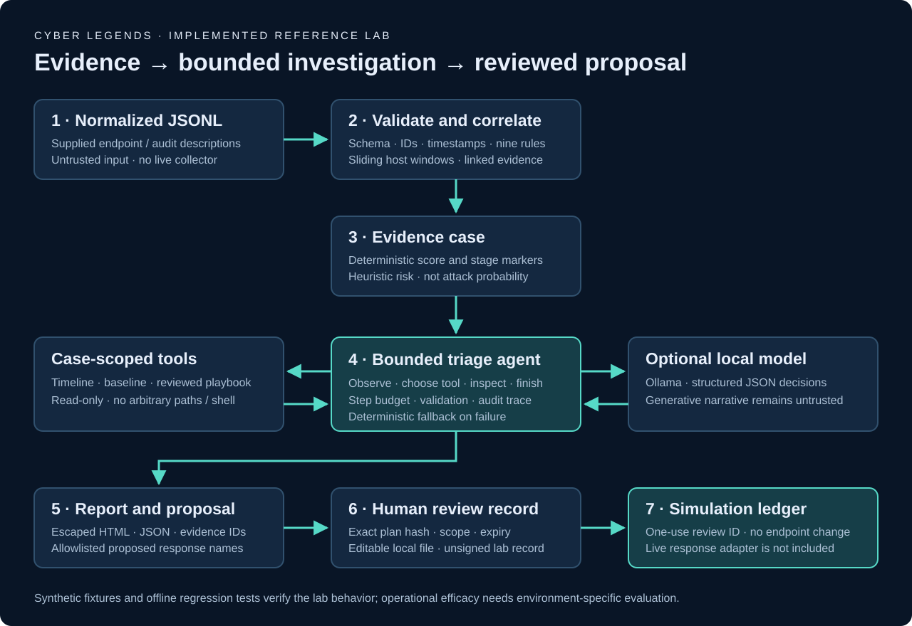
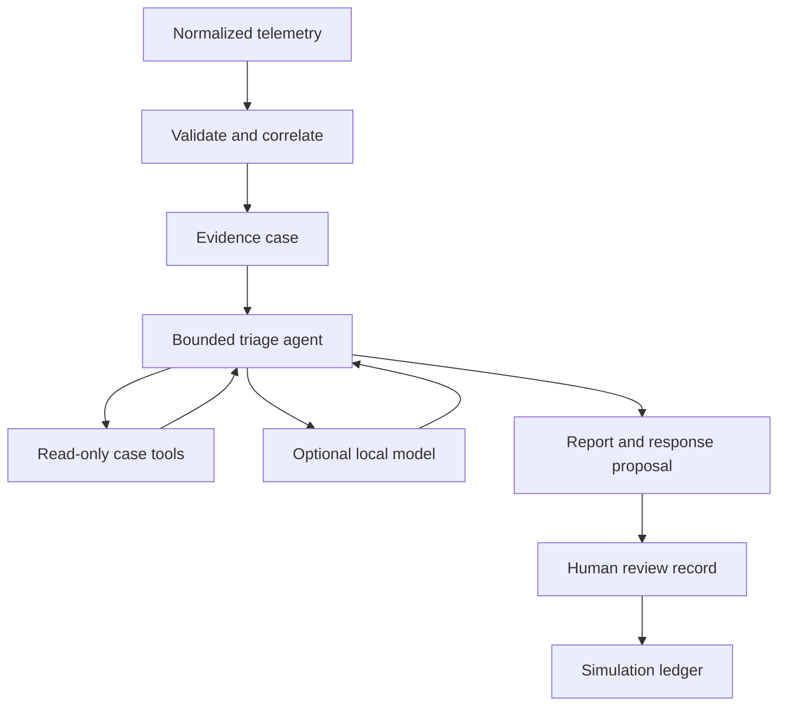

# Architecture and trust boundaries

## Implemented pipeline

| Module | Responsibility | Boundary |
| --- | --- | --- |
| `events.py` | Validate, sort and deduplicate normalized exports. | Inputs are untrusted descriptions, not executable telemetry collectors. |
| `detector.py` | Sliding-window rule evaluation, scores, stage markers and evidence IDs. | Deterministic code owns verdicts; a model cannot change them. |
| `agent.py` | Tool selection, observation history, finish validation and fallback. | Tool arguments cannot name arbitrary hosts, file paths, URLs or commands. |
| `llm.py` | Structured generation through a fixed Ollama loopback API. | Model output and event text remain untrusted. The service is controlled by the operator. |
| `response.py` | Hashed proposals, local review records and replay-checked simulation. | No live response adapter or authenticated approval authority exists. |
| `reports.py` | Escaped self-contained HTML and JSON outputs. | No script execution, remote assets or model-generated HTML. |
| `fixtures.py` | Synthetic event creation and fixture export. | Described backup/security/file operations are never performed. |
| `__main__.py` | CLI orchestration and explicit output/configuration paths. | Paths come from the operator CLI, never the model. |

## Agent behavior

The optional model-driven agent receives the current case summary and a bounded observation history. It selects one of three local read-only tools, then uses the observation to choose another step or finish. The loop limits its budget, rejects repeated calls, and validates evidence IDs and action names. Final output remains a draft for the analyst.

The default offline agent follows a deterministic investigation sequence. This mode is explicitly labeled `offline_rule_agent`. Only the optional Ollama mode invokes generative inference and uses the model to select tools. A failed model call retains deterministic triage and displays the reason.

## Case and scoring semantics

This batch release keeps one peak-risk case per host. It uses host-level correlation rather than process-tree or session-level linkage. Scores are capped sums of distinct rule weights. An alert is a reason to investigate, not proof of a ransomware operator or a forecast that an attack will occur.

The `first_warning_at` marker requires multiple precursor categories before a file-burst signal in that active window. `first_impact_at` records a heuristic file-volume signal, not confirmed file encryption. Separate attack episodes on the same host can be combined within a batch; use time-bounded batches and source verification.

## Extension points for a real deployment

Add authenticated event collectors outside this package. Implement source adapters, durable streaming state, late-event handling, tenant separation, validated time synchronization and operational monitoring. Keep the deterministic policy and authorization outside the model. Use a separately designed authorization/response service for any real action; the editable local simulator records are unsuitable for that role.
