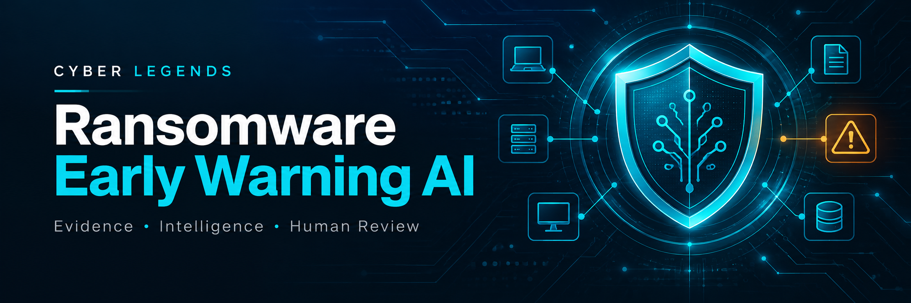
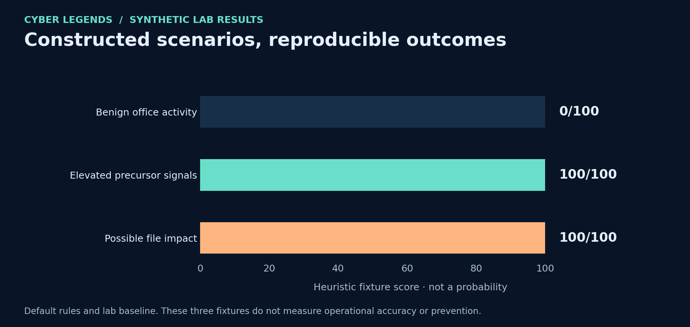

# Ransomware Early Warning AI

**A telemetry-first defensive project by [Cyber Legends](https://cyberlegends.org).**

Correlate early warning signals, explain the evidence with optional generative AI, and investigate through a bounded agent before reviewing a response plan.

**Status: working reference lab, version 0.1.0.** Python 3.11+ · standard library only for offline use · MIT License. This release analyzes supplied JSONL telemetry. It is not a live endpoint product and does not guarantee prediction or prevention of ransomware.

[Step-by-step implementation](IMPLEMENTATION.md) · [Roman Urdu guide](GUIDE_ROMAN_URDU.md) · [Detection catalogue](DETECTION_CATALOG.md) · [AI security design](AI_SECURITY.md) · [Validation record](VALIDATION.md)

## What you can run today

| Capability | Implementation |
| --- | --- |
| Evidence ingestion | Strict normalized schema, timezone validation, conflicting-ID rejection and duplicate handling. |
| Early warning | Nine configurable rules across recovery, defenses, identity, execution, remote access, canaries, file activity and outbound transfers. |
| Correlation | Five-minute sliding windows per host, one weight per rule, bounded scores and linked evidence IDs. |
| Generative AI | Optional installed Ollama model generates a structured investigation narrative and selects read-only tools. |
| Agentic investigation | Observe → choose tool → inspect result → choose next step → draft a plan, with a step budget and an audit trace. |
| Human review | An explicit reviewed record binds the host, evidence and proposed actions to a plan hash, expiry and one-use simulation ledger. |
| Reporting | Self-contained HTML dashboard and JSON case reports, including uncertainty and AI fallback notices. |

## Quick start

Clone this repository or use **Code → Download ZIP**, extract it, and open a terminal in the extracted project directory.

```bash
git clone https://github.com/CyberLegends/ransomware-early-warning-ai.git
cd ransomware-early-warning-ai
python -m ransomware_guard demo --out output/demo
python -m unittest discover -s tests -v
```

Open `output/demo/report.html` in your browser. On Linux/macOS, use `python3` if necessary; on Windows, `py -3` is an alternative. No administrator privileges, pip packages, API key or malware are needed for the offline demo.

**Expected synthetic demo:** `LAB-FINANCE-01` scores 100/100 with elevated precursor signals; `LAB-OFFICE-01` scores 0/100 with the included baseline. These are fixture outcomes, not measurements of real-world accuracy.



## Architecture


The detector owns scores and evidence. The agent can inspect the current case timeline, compare an administrator-supplied baseline and retrieve a reviewed playbook. A model cannot select a different host, arbitrary file path, URL or shell command. Response actions remain proposals; the response module only simulates them.

See [ARCHITECTURE.md](ARCHITECTURE.md) for trust boundaries, module responsibilities and deployment extensions.

## Analyze exported telemetry

```bash
python -m ransomware_guard analyze --input data/demo_precursors.jsonl --out output/precursors
python -m ransomware_guard analyze --input data/demo_benign.jsonl --out output/benign
python -m ransomware_guard analyze --input data/demo_impact.jsonl --out output/impact
```

The impact fixture has a precursor warning at 10:01:00 UTC and its first file-burst signal at 10:03:00 UTC. The 120-second gap is constructed demo timing; it is not a claimed production lead time. File-burst activity is labeled `possible_impact`, because the code does not inspect file contents or prove encryption.

## Enable generative and agentic AI

With an **already installed local Ollama service and local model**, replace the placeholder with the installed model name:

```bash
python -m ransomware_guard demo --model YOUR_INSTALLED_LOCAL_MODEL --out output/ai-demo
```

The adapter posts to `127.0.0.1:11434` with a JSON output schema, rejects redirects, bypasses environment proxies and limits response size and generation tokens. A maximum of three qualifying cases use AI by default. Model errors, invalid tools or exhausted budgets retain deterministic triage and create a warning.

**Verification limit:** the adapter and agent loop were tested with mocked responses. Inference against a running Ollama model remains untested. Verify your chosen model/service runs locally; loopback transport alone does not guarantee that the service will never forward data elsewhere. Model prose remains untrusted even after schema validation.

## Review a response simulation

Read the report and proposed actions before recording the review:

```bash
python -m ransomware_guard approve --report output/demo/report.json --case LAB-FINANCE-01 --reviewer lab-reviewer --reviewed --out output/approval.json
python -m ransomware_guard simulate-response --report output/demo/report.json --approval output/approval.json --ledger output/simulation-ledger.json --out output/simulation.json
```

The result explicitly states `external_systems_modified: false`. Reusing the review record with the same ledger is rejected. This editable local record is a lab workflow demonstration, not authenticated or signed production authorization.

## Repository guide

| Location | Purpose |
| --- | --- |
| [ransomware_guard](ransomware_guard) | Ingestion, detector, agent, Ollama adapter, reports, review simulation and CLI. |
| [config](config) | Rule thresholds/weights and administrator-supplied host baselines. |
| [data](data) | Four synthetic JSONL telemetry fixtures. |
| [tests](tests) | Regression tests for behavior and security boundaries. |
| [examples](examples) | Generated synthetic reports you can inspect before running code. |
| [images](images) | Brand banner, exact architecture diagram and fixture-result chart. |

## Operational limitations

Scores are hand-set heuristics, not a trained classifier or calibrated probabilities. Host-level correlation can combine unrelated users/processes, and legitimate administration can resemble suspicious behavior. Batch analysis has no persistent cross-run correlation, authenticated collection, distributed approval service or live response adapter. The input cap is 10 MiB / 20,000 events, with at most 1,000 events in a host window; an overly dense window fails explicitly.

Use [IMPLEMENTATION.md](IMPLEMENTATION.md) to develop an authorized, read-only pilot with a real telemetry source, verified normalization, separate tuning and holdout data, human review and measured false positives. No production accuracy, certification, client deployment or prevention guarantee is claimed.

## References and project support

Detection references are linked in [DETECTION_CATALOG.md](DETECTION_CATALOG.md). The [Ollama API documentation](https://docs.ollama.com/api/generate) describes the optional model interface. The [GitHub Python Actions guide](https://docs.github.com/en/actions/tutorials/build-and-test-code/python) informs the test workflow.

[Cyberlegends.org](https://cyberlegends.org) · [Cyber Legends GitHub](https://github.com/CyberLegends) · [Security reporting](SECURITY.md)
